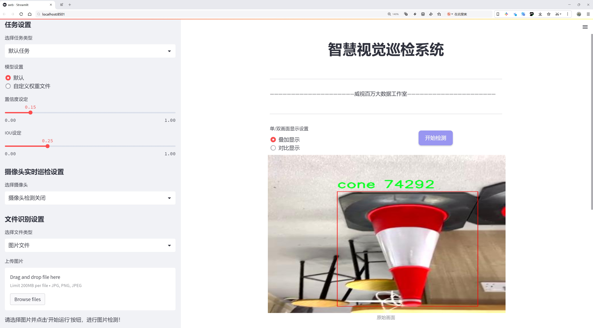
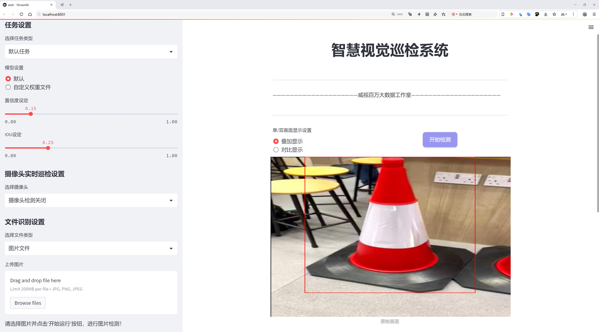
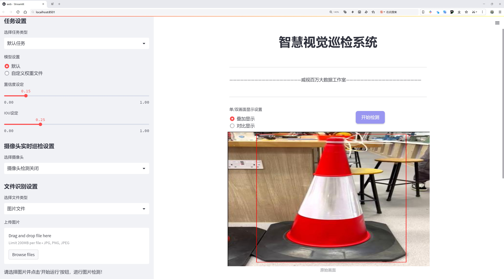
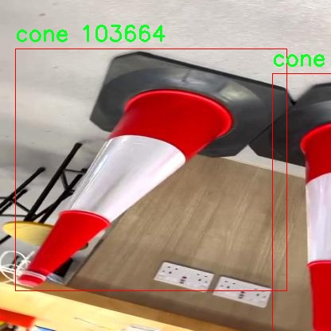
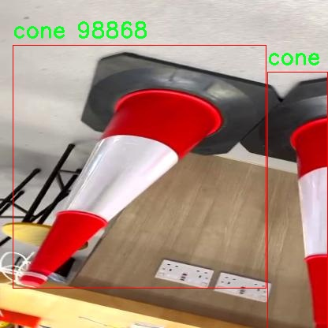
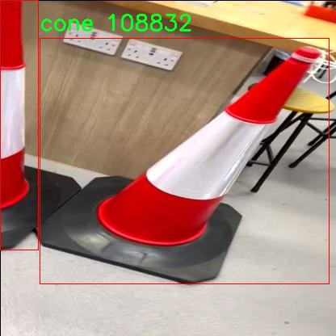
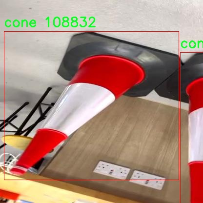
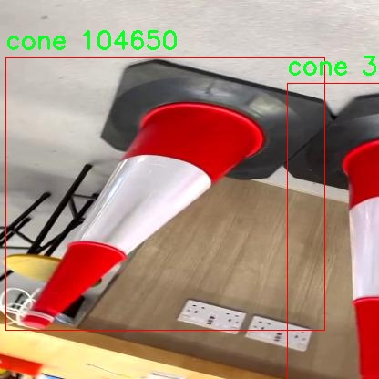

# 交通锥检测检测系统源码分享
 # [一条龙教学YOLOV8标注好的数据集一键训练_70+全套改进创新点发刊_Web前端展示]

### 1.研究背景与意义

项目参考[AAAI Association for the Advancement of Artificial Intelligence](https://gitee.com/qunmasj/projects)

项目来源[AACV Association for the Advancement of Computer Vision](https://kdocs.cn/l/cszuIiCKVNis)

研究背景与意义

随着城市化进程的加快，交通管理面临着日益严峻的挑战。交通锥作为一种重要的交通管理工具，广泛应用于道路施工、交通引导及安全防护等场景。其有效的使用不仅能够提高道路安全性，还能减少交通事故的发生。因此，开发一个高效、准确的交通锥检测系统显得尤为重要。传统的交通锥检测方法多依赖于人工监测或简单的图像处理技术，效率低下且容易受到环境因素的影响，难以满足现代交通管理的需求。

近年来，深度学习技术的迅猛发展为目标检测领域带来了新的机遇。YOLO（You Only Look Once）系列模型以其高效的实时检测能力和较高的准确率，成为了目标检测任务中的热门选择。特别是YOLOv8模型，凭借其改进的网络结构和算法优化，能够在保持高检测精度的同时显著提升处理速度，适用于实时交通监控场景。因此，基于改进YOLOv8的交通锥检测系统的研究，具有重要的理论价值和实际意义。

本研究将利用一个包含1600张图像的交通锥数据集进行模型训练和测试。该数据集涵盖了五种不同类别的交通锥，包括蓝色锥、橙色大锥、橙色小锥和黄色锥等。这些类别的多样性为模型的训练提供了丰富的样本，能够有效提升模型对不同类型交通锥的识别能力。此外，数据集中图像的多样性和复杂性，如不同的光照条件、背景环境和锥体的摆放方式，将进一步增强模型的鲁棒性，使其在实际应用中更具适应性。

通过对YOLOv8模型的改进，我们将探索更高效的特征提取方法和优化的损失函数，以提高交通锥的检测精度和速度。同时，研究将重点关注模型在复杂场景下的表现，包括在低光照、遮挡及不同天气条件下的检测能力。这将为交通管理提供更为可靠的技术支持，帮助交通管理部门实现智能化、自动化的监控与管理。

综上所述，基于改进YOLOv8的交通锥检测系统的研究，不仅能够推动目标检测技术在交通管理领域的应用，还将为城市交通安全提供有力保障。通过实现高效、准确的交通锥检测，能够显著提升交通管理的智能化水平，减少人为错误，降低交通事故的发生率，最终为公众的出行安全提供更为坚实的保障。因此，本研究具有重要的理论意义和实际应用价值，期待能够为未来的交通管理系统发展提供新的思路和解决方案。

### 2.图片演示







##### 注意：由于此博客编辑较早，上面“2.图片演示”和“3.视频演示”展示的系统图片或者视频可能为老版本，新版本在老版本的基础上升级如下：（实际效果以升级的新版本为准）

  （1）适配了YOLOV8的“目标检测”模型和“实例分割”模型，通过加载相应的权重（.pt）文件即可自适应加载模型。

  （2）支持“图片识别”、“视频识别”、“摄像头实时识别”三种识别模式。

  （3）支持“图片识别”、“视频识别”、“摄像头实时识别”三种识别结果保存导出，解决手动导出（容易卡顿出现爆内存）存在的问题，识别完自动保存结果并导出到tempDir中。

  （4）支持Web前端系统中的标题、背景图等自定义修改，后面提供修改教程。

  另外本项目提供训练的数据集和训练教程,暂不提供权重文件（best.pt）,需要您按照教程进行训练后实现图片演示和Web前端界面演示的效果。

### 3.视频演示

[3.1 视频演示](https://www.bilibili.com/video/BV1qAx5etEeH/)

### 4.数据集信息展示

##### 4.1 本项目数据集详细数据（类别数＆类别名）

nc: 3
names: ['blue', 'cone', 'yellow']


##### 4.2 本项目数据集信息介绍

数据集信息展示

在现代交通管理和智能交通系统的发展中，交通锥的检测与识别显得尤为重要。为了提升YOLOv8在交通锥检测任务中的性能，我们构建了一个专门的数据集，命名为“traffic_cone”。该数据集旨在为交通锥的自动检测提供高质量的训练样本，进而推动相关技术的进步和应用。

“traffic_cone”数据集包含三种主要类别，分别是“blue”（蓝色交通锥）、“cone”（标准交通锥）和“yellow”（黄色交通锥）。这三种类别的选择不仅考虑到了交通锥在实际应用中的多样性，也反映了不同颜色交通锥在不同场景下的使用频率和重要性。蓝色交通锥通常用于特定的指示或警告，黄色交通锥则常见于施工区域的标识，而标准交通锥则是最为常见的交通引导工具。通过对这三种类别的精确标注和丰富样本的收集，我们希望能够提升YOLOv8在多种环境下的检测能力。

数据集的构建过程包括多个步骤，首先是数据的收集。我们从不同的城市和道路环境中收集了大量的交通锥图像，确保样本的多样性和代表性。这些图像不仅涵盖了不同的天气条件和光照情况，还包括了各种背景和场景，以增强模型的鲁棒性。其次，我们对收集到的图像进行了详细的标注工作，确保每个交通锥的边界框和类别信息准确无误。这一过程采用了先进的标注工具，确保数据的高质量和一致性。

在数据集的规模方面，“traffic_cone”数据集包含了数千张图像，涵盖了丰富的场景和角度。这些图像不仅包括单个交通锥的特写，还包含了多个交通锥在同一画面中的情况，进一步增强了模型在复杂场景下的检测能力。此外，为了提高模型的泛化能力，我们还对图像进行了多种数据增强处理，如旋转、缩放、裁剪和颜色变换等，使得模型能够更好地适应不同的实际应用场景。

在训练过程中，我们将“traffic_cone”数据集与YOLOv8模型相结合，利用其强大的特征提取和目标检测能力，进行深度学习训练。通过不断的迭代和优化，我们期望能够实现对交通锥的高精度检测，从而为智能交通系统的应用提供有力支持。

总之，“traffic_cone”数据集的构建不仅为YOLOv8的交通锥检测系统提供了丰富的训练数据，也为未来的研究和应用奠定了坚实的基础。通过这一数据集，我们希望能够推动交通管理技术的发展，提高交通安全性和效率，为城市交通的智能化转型贡献力量。











### 5.全套项目环境部署视频教程（零基础手把手教学）

[5.1 环境部署教程链接（零基础手把手教学）](https://www.ixigua.com/7404473917358506534?logTag=c807d0cbc21c0ef59de5)


[5.2 安装Python虚拟环境创建和依赖库安装视频教程链接（零基础手把手教学）](https://www.ixigua.com/7404474678003106304?logTag=1f1041108cd1f708b01a)

### 6.手把手YOLOV8训练视频教程（零基础小白有手就能学会）

[6.1 手把手YOLOV8训练视频教程（零基础小白有手就能学会）](https://www.ixigua.com/7404477157818401292?logTag=d31a2dfd1983c9668658)

### 7.70+种全套YOLOV8创新点代码加载调参视频教程（一键加载写好的改进模型的配置文件）

[7.1 70+种全套YOLOV8创新点代码加载调参视频教程（一键加载写好的改进模型的配置文件）](https://www.ixigua.com/7404478314661806627?logTag=29066f8288e3f4eea3a4)

### 8.70+种全套YOLOV8创新点原理讲解（非科班也可以轻松写刊发刊，V10版本正在科研待更新）

由于篇幅限制，每个创新点的具体原理讲解就不一一展开，具体见下列网址中的创新点对应子项目的技术原理博客网址【Blog】：


[8.1 70+种全套YOLOV8创新点原理讲解链接](https://gitee.com/qunmasj/good)

### 9.系统功能展示（检测对象为举例，实际内容以本项目数据集为准）

图9.1.系统支持检测结果表格显示

  图9.2.系统支持置信度和IOU阈值手动调节

  图9.3.系统支持自定义加载权重文件best.pt(需要你通过步骤5中训练获得)

  图9.4.系统支持摄像头实时识别

  图9.5.系统支持图片识别

  图9.6.系统支持视频识别

  图9.7.系统支持识别结果文件自动保存

  图9.8.系统支持Excel导出检测结果数据


### 10.原始YOLOV8算法原理

原始YOLOv8算法原理

YOLOv8作为YOLO系列的最新成员，标志着目标检测领域的又一次技术飞跃。相较于前一代的YOLOv5，YOLOv8在检测精度和速度上均实现了显著的提升，体现了深度学习技术在计算机视觉中的不断进步。YOLOv8的设计理念是为不同的应用场景提供灵活的解决方案，因此它被细分为多个版本，包括YOLOv8n、YOLOv8s、YOLOv8m、YOLOv8l和YOLOv8x，每个版本在网络深度和检测精度上都有所不同。特别是YOLOv8n版本，以其最小的参数量和最快的检测速度，成为了实时应用的理想选择。

YOLOv8的网络结构可以分为四个主要部分：输入端、骨干网络、颈部网络和头部网络。输入端采用了马赛克数据增强技术，这种方法通过将多张图像拼接在一起，能够有效提升模型的鲁棒性和泛化能力。此外，YOLOv8引入了自适应锚框计算和自适应灰度填充，以更好地适应不同场景下的图像特征。这些创新的输入处理方式为后续的特征提取和目标检测奠定了坚实的基础。

在骨干网络部分，YOLOv8采用了C2f模块和SPPF（Spatial Pyramid Pooling Fusion）结构。C2f模块的设计灵感来源于YOLOv7的ELAN结构，通过引入更多的分支和跨层连接，显著增强了模型的梯度流动性。这种结构不仅提升了特征表示能力，还有效减轻了模型的计算负担，使得YOLOv8在处理复杂场景时能够保持高效的性能。SPPF模块则进一步提高了模型的计算速度，确保在多尺度特征融合的过程中，能够快速响应不同尺寸目标的检测需求。

颈部网络采用了路径聚合网络（PAN）结构，旨在加强不同缩放尺度对象的特征融合能力。PAN通过在特征图的不同层次之间建立连接，能够有效整合来自不同层次的特征信息，从而提升模型对小目标和大目标的检测能力。这种特征融合策略使得YOLOv8在面对复杂背景和多样化目标时，依然能够保持较高的检测精度。

头部网络则是YOLOv8的一大创新之处。与以往的耦合头结构不同，YOLOv8采用了解耦头结构，将分类和检测过程分开进行。这种设计使得模型在处理分类任务和定位任务时，可以更加专注于各自的目标，从而提高了收敛速度和预测精度。此外，YOLOv8引入了无锚框检测方式，直接预测目标的中心位置，减少了锚框预测的数量，这一变化显著加速了非最大抑制（NMS）过程，提升了整体检测效率。

在损失计算方面，YOLOv8采用了Task-Aligned Assigner（TAL）策略，通过对分类与回归的分数进行加权，优化正负样本的分配。这一策略确保了模型在训练过程中能够有效学习到目标的特征，同时引入了二元交叉熵损失（BCELoss）和分布焦点损失（DFLoss）等多种损失函数，进一步提升了模型对边界框预测的准确性。

YOLOv8的设计不仅关注于算法的精度和速度，还考虑到了模型的轻量化。通过对不同尺度模型调整通道数，YOLOv8实现了更为精简的模型结构，确保在不牺牲性能的前提下，能够适应各种计算资源的限制。这一特性使得YOLOv8在实际应用中具备了更强的灵活性，能够在移动设备和边缘计算平台上高效运行。

综上所述，YOLOv8的原始算法原理体现了深度学习在目标检测领域的最新发展趋势。通过创新的网络结构设计、灵活的特征融合策略和高效的损失计算方法，YOLOv8不仅提升了检测精度和速度，还为实时目标检测任务提供了强有力的支持。随着YOLOv8的广泛应用，其在智能监控、自动驾驶、机器人视觉等领域的潜力将不断被挖掘，为未来的计算机视觉研究开辟新的方向。


### 11.项目核心源码讲解（再也不用担心看不懂代码逻辑）

#### 11.1 70+种YOLOv8算法改进源码大全和调试加载训练教程（非必要）\ultralytics\utils\callbacks\wb.py

以下是经过简化和注释的核心代码部分，保留了主要功能并进行了详细的中文注释：

```python
# 导入必要的库
from ultralytics.utils import SETTINGS, TESTS_RUNNING
from ultralytics.utils.torch_utils import model_info_for_loggers
import numpy as np
import pandas as pd

# 尝试导入wandb库并进行基本的配置检查
try:
    assert not TESTS_RUNNING  # 确保不是在测试环境中
    assert SETTINGS['wandb'] is True  # 确保WandB集成已启用
    import wandb as wb
    assert hasattr(wb, '__version__')  # 确保wandb包是有效的

    _processed_plots = {}  # 用于记录已处理的图表

except (ImportError, AssertionError):
    wb = None  # 如果导入失败，设置wb为None


def _custom_table(x, y, classes, title='Precision Recall Curve', x_title='Recall', y_title='Precision'):
    """
    创建并记录自定义的精确度-召回率曲线可视化。

    参数:
        x (List): x轴的值，长度为N。
        y (List): y轴的值，长度为N。
        classes (List): 每个点的类别标签，长度为N。
        title (str): 图表标题，默认为'Precision Recall Curve'。
        x_title (str): x轴标签，默认为'Recall'。
        y_title (str): y轴标签，默认为'Precision'。

    返回:
        (wandb.Object): 适合记录的wandb对象，展示自定义的可视化指标。
    """
    df = pd.DataFrame({'class': classes, 'y': y, 'x': x}).round(3)  # 创建数据框
    fields = {'x': 'x', 'y': 'y', 'class': 'class'}
    string_fields = {'title': title, 'x-axis-title': x_title, 'y-axis-title': y_title}
    return wb.plot_table('wandb/area-under-curve/v0',
                         wb.Table(dataframe=df),
                         fields=fields,
                         string_fields=string_fields)


def _plot_curve(x, y, names=None, id='precision-recall', title='Precision Recall Curve', x_title='Recall', y_title='Precision', num_x=100, only_mean=False):
    """
    记录指标曲线可视化。

    参数:
        x (np.ndarray): x轴数据点，长度为N。
        y (np.ndarray): y轴数据点，形状为CxN，C为类别数。
        names (list): 类别名称，长度为C。
        id (str): 记录数据的唯一标识符，默认为'precision-recall'。
        title (str): 可视化图表的标题，默认为'Precision Recall Curve'。
        x_title (str): x轴标签，默认为'Recall'。
        y_title (str): y轴标签，默认为'Precision'。
        num_x (int): 可视化的插值数据点数量，默认为100。
        only_mean (bool): 是否仅绘制均值曲线，默认为True。
    """
    if names is None:
        names = []  # 如果没有提供类别名称，则初始化为空列表
    x_new = np.linspace(x[0], x[-1], num_x).round(5)  # 创建新的x值

    # 创建记录用的数组
    x_log = x_new.tolist()
    y_log = np.interp(x_new, x, np.mean(y, axis=0)).round(3).tolist()  # 计算均值并插值

    if only_mean:
        # 仅记录均值曲线
        table = wb.Table(data=list(zip(x_log, y_log)), columns=[x_title, y_title])
        wb.run.log({title: wb.plot.line(table, x_title, y_title, title=title)})
    else:
        # 记录每个类别的曲线
        classes = ['mean'] * len(x_log)
        for i, yi in enumerate(y):
            x_log.extend(x_new)  # 添加新的x值
            y_log.extend(np.interp(x_new, x, yi))  # 将y插值到新的x
            classes.extend([names[i]] * len(x_new))  # 添加类别名称
        wb.log({id: _custom_table(x_log, y_log, classes, title, x_title, y_title)}, commit=False)


def on_fit_epoch_end(trainer):
    """在每个训练周期结束时记录训练指标和模型信息。"""
    wb.run.log(trainer.metrics, step=trainer.epoch + 1)  # 记录当前周期的指标
    # 记录图表
    _log_plots(trainer.plots, step=trainer.epoch + 1)
    _log_plots(trainer.validator.plots, step=trainer.epoch + 1)
    if trainer.epoch == 0:
        wb.run.log(model_info_for_loggers(trainer), step=trainer.epoch + 1)  # 记录模型信息


def on_train_end(trainer):
    """在训练结束时保存最佳模型作为artifact。"""
    _log_plots(trainer.validator.plots, step=trainer.epoch + 1)
    _log_plots(trainer.plots, step=trainer.epoch + 1)
    art = wb.Artifact(type='model', name=f'run_{wb.run.id}_model')  # 创建artifact
    if trainer.best.exists():
        art.add_file(trainer.best)  # 添加最佳模型文件
        wb.run.log_artifact(art, aliases=['best'])  # 记录artifact
    # 记录每个曲线的可视化
    for curve_name, curve_values in zip(trainer.validator.metrics.curves, trainer.validator.metrics.curves_results):
        x, y, x_title, y_title = curve_values
        _plot_curve(
            x,
            y,
            names=list(trainer.validator.metrics.names.values()),
            id=f'curves/{curve_name}',
            title=curve_name,
            x_title=x_title,
            y_title=y_title,
        )
    wb.run.finish()  # 结束当前运行

# 定义回调函数
callbacks = {
    'on_fit_epoch_end': on_fit_epoch_end,
    'on_train_end': on_train_end
} if wb else {}
```

### 主要功能说明：
1. **WandB集成**：代码中通过`wandb`库记录训练过程中的指标和可视化图表。
2. **精确度-召回率曲线**：通过`_custom_table`和`_plot_curve`函数生成和记录精确度-召回率曲线。
3. **训练周期结束时的记录**：在每个训练周期结束时，记录训练指标和模型信息。
4. **训练结束时的模型保存**：在训练结束时保存最佳模型，并记录相关的可视化信息。

### 注意事项：
- 代码中使用了`try-except`块来处理可能的导入错误和配置错误。
- 所有的图表和模型信息都通过WandB进行记录，以便于后续的分析和可视化。

这个文件是Ultralytics YOLO模型的一个回调模块，主要用于与Weights & Biases（wandb）集成，以便在训练过程中记录和可视化模型的性能指标。文件的开头部分导入了一些必要的库，并进行了初步的设置和检查，确保wandb库可用并且未在测试模式下运行。

在文件中，定义了一些辅助函数。首先是`_custom_table`函数，它用于创建和记录一个自定义的精确度-召回曲线的可视化图表。这个函数接受x轴和y轴的数据点、类别标签以及图表的标题等参数，并生成一个适合wandb记录的表格对象。

接下来是`_plot_curve`函数，它用于记录一个度量曲线的可视化。这个函数可以生成基于输入数据的曲线，并根据`only_mean`参数决定是绘制所有类别的曲线还是仅绘制平均曲线。它使用了`_custom_table`函数来生成实际的可视化。

`_log_plots`函数用于记录输入字典中的图表，如果在指定的步骤中尚未记录过这些图表，它会将图表记录到wandb中。

接下来的几个函数分别在不同的训练阶段被调用。`on_pretrain_routine_start`函数在预训练例程开始时被调用，初始化wandb项目。`on_fit_epoch_end`函数在每个训练周期结束时记录训练指标和模型信息。`on_train_epoch_end`函数在每个训练周期结束时记录损失和学习率，并在第一周期结束时记录图表。`on_train_end`函数在训练结束时保存最佳模型，并记录验证指标的曲线。

最后，文件定义了一个回调字典`callbacks`，其中包含了上述函数的引用，以便在wandb可用时自动调用这些回调函数。

总体来说，这个文件的主要功能是集成wandb，以便在YOLO模型训练过程中记录和可视化各种性能指标，帮助用户更好地监控和分析模型的训练过程。

#### 11.2 ui.py

以下是经过简化和注释的核心代码部分：

```python
import sys
import subprocess

def run_script(script_path):
    """
    使用当前 Python 环境运行指定的脚本。

    Args:
        script_path (str): 要运行的脚本路径

    Returns:
        None
    """
    # 获取当前 Python 解释器的路径
    python_path = sys.executable

    # 构建运行命令，使用 streamlit 运行指定的脚本
    command = f'"{python_path}" -m streamlit run "{script_path}"'

    # 执行命令，并等待其完成
    result = subprocess.run(command, shell=True)
    
    # 检查命令执行结果，如果返回码不为0，则表示出错
    if result.returncode != 0:
        print("脚本运行出错。")

# 主程序入口
if __name__ == "__main__":
    # 指定要运行的脚本路径
    script_path = "web.py"  # 这里可以直接指定脚本名，假设它在当前目录下

    # 调用函数运行脚本
    run_script(script_path)
```

### 代码注释说明：
1. **导入模块**：
   - `sys`：用于获取当前 Python 解释器的路径。
   - `subprocess`：用于执行外部命令。

2. **`run_script` 函数**：
   - 接收一个脚本路径作为参数，并使用当前 Python 环境运行该脚本。
   - 使用 `sys.executable` 获取当前 Python 解释器的路径，以确保使用正确的 Python 版本。
   - 构建命令字符串，使用 `streamlit` 模块运行指定的脚本。
   - 使用 `subprocess.run` 执行命令，并等待其完成。
   - 检查命令的返回码，如果不为0，打印错误信息。

3. **主程序入口**：
   - 使用 `if __name__ == "__main__":` 确保代码仅在直接运行时执行。
   - 指定要运行的脚本路径（在此示例中为 `web.py`）。
   - 调用 `run_script` 函数来执行指定的脚本。

这个程序文件的主要功能是通过当前的 Python 环境来运行一个指定的脚本，具体是一个名为 `web.py` 的文件。程序首先导入了必要的模块，包括 `sys`、`os` 和 `subprocess`，这些模块提供了与系统交互和执行外部命令的功能。此外，还导入了 `abs_path` 函数，这个函数来自于 `QtFusion.path` 模块，用于获取文件的绝对路径。

在 `run_script` 函数中，首先获取当前 Python 解释器的路径，这样可以确保使用正确的 Python 环境来运行脚本。接着，构建一个命令字符串，该命令使用 `streamlit` 模块来运行指定的脚本。这里使用了 `subprocess.run` 方法来执行这个命令，并且设置 `shell=True` 以便在 shell 中运行命令。

在执行命令后，程序会检查返回的状态码。如果状态码不为零，表示脚本运行过程中出现了错误，此时会打印出一条错误信息。

在文件的最后部分，使用 `if __name__ == "__main__":` 语句来确保只有在直接运行该文件时才会执行下面的代码。在这里，首先调用 `abs_path` 函数获取 `web.py` 的绝对路径，然后调用 `run_script` 函数来运行这个脚本。

总体来说，这个程序的设计目的是为了方便地在指定的 Python 环境中运行一个 Streamlit 应用，确保用户能够轻松启动和调试自己的 Web 应用。

#### 11.3 70+种YOLOv8算法改进源码大全和调试加载训练教程（非必要）\ultralytics\solutions\ai_gym.py

以下是代码中最核心的部分，并附上详细的中文注释：

```python
import cv2
from ultralytics.utils.plotting import Annotator

class AIGym:
    """管理实时视频流中人们的健身动作的类。"""

    def __init__(self):
        """初始化AIGym，设置视觉和图像参数的默认值。"""
        self.im0 = None  # 当前帧图像
        self.tf = None   # 线条厚度
        self.keypoints = None  # 关键点数据
        self.poseup_angle = None  # 上升姿势的角度阈值
        self.posedown_angle = None  # 下降姿势的角度阈值
        self.threshold = 0.001  # 阈值（未使用）
        self.angle = None  # 当前角度
        self.count = None  # 动作计数
        self.stage = None  # 当前阶段（上/下）
        self.pose_type = 'pushup'  # 动作类型（如俯卧撑）
        self.kpts_to_check = None  # 用于计数的关键点

        self.view_img = False  # 是否显示图像
        self.annotator = None  # 注释器对象

    def set_args(self, kpts_to_check, line_thickness=2, view_img=False, pose_up_angle=145.0, pose_down_angle=90.0, pose_type='pullup'):
        """
        配置AIGym的参数。
        Args:
            kpts_to_check (list): 用于计数的3个关键点
            line_thickness (int): 边界框的线条厚度
            view_img (bool): 是否显示图像
            pose_up_angle (float): 上升姿势的角度
            pose_down_angle (float): 下降姿势的角度
            pose_type: 动作类型（如"pushup", "pullup"或"abworkout"）
        """
        self.kpts_to_check = kpts_to_check  # 设置需要检查的关键点
        self.tf = line_thickness  # 设置线条厚度
        self.view_img = view_img  # 设置是否显示图像
        self.poseup_angle = pose_up_angle  # 设置上升姿势的角度
        self.posedown_angle = pose_down_angle  # 设置下降姿势的角度
        self.pose_type = pose_type  # 设置动作类型

    def start_counting(self, im0, results, frame_count):
        """
        计数健身动作的函数。
        Args:
            im0 (ndarray): 当前视频流的帧图像
            results: 姿态估计数据
            frame_count: 当前帧计数
        """
        self.im0 = im0  # 保存当前帧图像
        if frame_count == 1:
            # 初始化计数、角度和阶段
            self.count = [0] * len(results[0])
            self.angle = [0] * len(results[0])
            self.stage = ['-' for _ in results[0]]
        
        self.keypoints = results[0].keypoints.data  # 获取关键点数据
        self.annotator = Annotator(im0, line_width=2)  # 创建注释器对象

        # 遍历每个关键点
        for ind, k in enumerate(reversed(self.keypoints)):
            # 计算姿势角度
            self.angle[ind] = self.annotator.estimate_pose_angle(
                k[int(self.kpts_to_check[0])].cpu(),
                k[int(self.kpts_to_check[1])].cpu(),
                k[int(self.kpts_to_check[2])].cpu()
            )
            # 绘制关键点
            self.im0 = self.annotator.draw_specific_points(k, self.kpts_to_check, shape=(640, 640), radius=10)

            # 根据动作类型更新阶段和计数
            if self.pose_type == 'pushup':
                if self.angle[ind] > self.poseup_angle:
                    self.stage[ind] = 'up'
                if self.angle[ind] < self.posedown_angle and self.stage[ind] == 'up':
                    self.stage[ind] = 'down'
                    self.count[ind] += 1

            elif self.pose_type == 'pullup':
                if self.angle[ind] > self.poseup_angle:
                    self.stage[ind] = 'down'
                if self.angle[ind] < self.posedown_angle and self.stage[ind] == 'down':
                    self.stage[ind] = 'up'
                    self.count[ind] += 1

            # 绘制角度、计数和阶段信息
            self.annotator.plot_angle_and_count_and_stage(
                angle_text=self.angle[ind],
                count_text=self.count[ind],
                stage_text=self.stage[ind],
                center_kpt=k[int(self.kpts_to_check[1])],
                line_thickness=self.tf
            )

            # 绘制所有关键点
            self.annotator.kpts(k, shape=(640, 640), radius=1, kpt_line=True)

        # 如果需要显示图像，则展示当前帧
        if self.view_img:
            cv2.imshow('Ultralytics YOLOv8 AI GYM', self.im0)
            if cv2.waitKey(1) & 0xFF == ord('q'):
                return

if __name__ == '__main__':
    AIGym()  # 创建AIGym实例
```

### 代码核心部分说明：
1. **类的初始化**：设置了一些用于姿态估计和计数的基本参数。
2. **设置参数**：`set_args`方法用于配置关键点、线条厚度、是否显示图像以及姿势的角度阈值。
3. **计数逻辑**：`start_counting`方法是核心功能，负责处理每一帧图像，计算姿势角度，并根据角度更新动作的阶段和计数。根据不同的动作类型（如俯卧撑、引体向上），有不同的逻辑来判断动作的完成情况。
4. **可视化**：使用`Annotator`类来绘制关键点、角度、计数和阶段信息，并在需要时显示图像。

这个程序文件定义了一个名为 `AIGym` 的类，主要用于在实时视频流中管理人们的健身动作（如俯卧撑、引体向上等）的计数和姿势估计。程序首先导入了必要的库，包括 OpenCV 和 Ultralytics 的绘图工具。

在 `AIGym` 类的初始化方法中，定义了一些用于图像处理和姿势估计的默认参数。这些参数包括图像数据、线条厚度、关键点信息、姿势角度、计数、阶段、姿势类型等。程序还定义了一个用于可视化的标注器。

类中有一个 `set_args` 方法，用于配置一些参数，如需要检查的关键点、线条厚度、是否显示图像、上升和下降姿势的角度以及姿势类型（如俯卧撑、引体向上或腹部锻炼）。这些参数的设置可以帮助程序更好地识别和计数用户的健身动作。

`start_counting` 方法是程序的核心功能，负责处理每一帧图像并进行健身动作的计数。该方法接收当前帧图像、姿势估计结果和帧计数作为输入。首先，程序会在第一帧初始化计数、角度和阶段等信息。然后，程序遍历每个关键点，计算姿势角度，并根据设定的角度阈值判断用户的动作阶段（如上升或下降）。根据不同的姿势类型，程序会相应地更新计数和阶段，并在图像上绘制关键点、角度、计数和阶段信息。

最后，如果设置了可视化参数，程序会使用 OpenCV 显示处理后的图像，并在用户按下 'q' 键时退出。

整个程序通过结合姿势估计和实时视频流处理，能够实现对健身动作的自动计数和监控，适用于健身训练和姿势纠正等场景。

#### 11.4 70+种YOLOv8算法改进源码大全和调试加载训练教程（非必要）\ultralytics\utils\metrics.py

以下是代码中最核心的部分，并附上详细的中文注释：

```python
import numpy as np
import torch

def box_iou(box1, box2, eps=1e-7):
    """
    计算两个边界框的交并比（IoU）。
    
    参数:
        box1 (torch.Tensor): 形状为 (N, 4) 的张量，表示 N 个边界框。
        box2 (torch.Tensor): 形状为 (M, 4) 的张量，表示 M 个边界框。
        eps (float, optional): 避免除以零的小值，默认为 1e-7。

    返回:
        (torch.Tensor): 形状为 (N, M) 的张量，包含 box1 和 box2 中每对边界框的 IoU 值。
    """
    # 获取边界框的坐标
    (a1, a2), (b1, b2) = box1.unsqueeze(1).chunk(2, 2), box2.unsqueeze(0).chunk(2, 2)
    
    # 计算交集面积
    inter = (torch.min(a2, b2) - torch.max(a1, b1)).clamp_(0).prod(2)

    # 计算 IoU = 交集 / (面积1 + 面积2 - 交集)
    return inter / ((a2 - a1).prod(2) + (b2 - b1).prod(2) - inter + eps)

def bbox_iou(box1, box2, xywh=True, eps=1e-7):
    """
    计算 box1 (1, 4) 与 box2 (n, 4) 的交并比（IoU）。
    
    参数:
        box1 (torch.Tensor): 形状为 (1, 4) 的张量，表示单个边界框。
        box2 (torch.Tensor): 形状为 (n, 4) 的张量，表示 n 个边界框。
        xywh (bool, optional): 如果为 True，输入框为 (x, y, w, h) 格式；如果为 False，输入框为 (x1, y1, x2, y2) 格式。默认为 True。
        eps (float, optional): 避免除以零的小值，默认为 1e-7。

    返回:
        (torch.Tensor): IoU 值。
    """
    # 将 (x, y, w, h) 转换为 (x1, y1, x2, y2) 格式
    if xywh:
        (x1, y1, w1, h1), (x2, y2, w2, h2) = box1.chunk(4, -1), box2.chunk(4, -1)
        b1_x1, b1_x2, b1_y1, b1_y2 = x1 - w1 / 2, x1 + w1 / 2, y1 - h1 / 2, y1 + h1 / 2
        b2_x1, b2_x2, b2_y1, b2_y2 = x2 - w2 / 2, x2 + w2 / 2, y2 - h2 / 2, y2 + h2 / 2
    else:
        b1_x1, b1_y1, b1_x2, b1_y2 = box1.chunk(4, -1)
        b2_x1, b2_y1, b2_x2, b2_y2 = box2.chunk(4, -1)

    # 计算交集面积
    inter = (b1_x2.minimum(b2_x2) - b1_x1.maximum(b2_x1)).clamp_(0) * \
            (b1_y2.minimum(b2_y2) - b1_y1.maximum(b2_y1)).clamp_(0)

    # 计算并集面积
    union = (b1_x2 - b1_x1) * (b1_y2 - b1_y1 + eps) + (b2_x2 - b2_x1) * (b2_y2 - b2_y1 + eps) - inter + eps

    # 计算 IoU
    return inter / union

def ap_per_class(tp, conf, pred_cls, target_cls, plot=False, save_dir=None, names=(), eps=1e-16):
    """
    计算每个类别的平均精度（AP）。
    
    参数:
        tp (np.ndarray): 二进制数组，指示检测是否正确（True）或不正确（False）。
        conf (np.ndarray): 检测的置信度分数数组。
        pred_cls (np.ndarray): 检测的预测类别数组。
        target_cls (np.ndarray): 真实类别数组。
        plot (bool, optional): 是否绘制 PR 曲线，默认为 False。
        save_dir (Path, optional): 保存 PR 曲线的目录，默认为 None。
        names (tuple, optional): 类别名称的元组，默认为空元组。
        eps (float, optional): 避免除以零的小值，默认为 1e-16。

    返回:
        (tuple): 包含每个类别的 TP、FP、精度、召回率、F1 分数和 AP 的元组。
    """
    # 按照置信度排序
    i = np.argsort(-conf)
    tp, conf, pred_cls = tp[i], conf[i], pred_cls[i]

    # 找到唯一的类别
    unique_classes, nt = np.unique(target_cls, return_counts=True)
    nc = unique_classes.shape[0]  # 类别数量

    # 创建精度-召回曲线并计算每个类别的 AP
    ap = np.zeros((nc, 10))  # 每个类别的 AP
    for ci, c in enumerate(unique_classes):
        i = pred_cls == c
        n_l = nt[ci]  # 标签数量
        n_p = i.sum()  # 预测数量
        if n_p == 0 or n_l == 0:
            continue

        # 累计 FP 和 TP
        fpc = (1 - tp[i]).cumsum(0)
        tpc = tp[i].cumsum(0)

        # 计算召回率
        recall = tpc / (n_l + eps)  # 召回率曲线

        # 计算精度
        precision = tpc / (tpc + fpc)  # 精度曲线

        # 计算 AP
        ap[ci] = compute_ap(recall, precision)

    return ap, unique_classes.astype(int)

def compute_ap(recall, precision):
    """
    计算给定召回率和精度曲线的平均精度（AP）。
    
    参数:
        recall (list): 召回率曲线。
        precision (list): 精度曲线。

    返回:
        (float): 平均精度。
    """
    # 在开头和结尾添加哨兵值
    mrec = np.concatenate(([0.0], recall, [1.0]))
    mpre = np.concatenate(([1.0], precision, [0.0]))

    # 计算精度包络
    mpre = np.flip(np.maximum.accumulate(np.flip(mpre)))

    # 计算曲线下面积
    ap = np.trapz(mpre, mrec)  # 使用梯形法则积分
    return ap
```

### 代码核心部分解释：
1. **box_iou**: 计算两个边界框之间的交并比（IoU），用于评估目标检测的性能。
2. **bbox_iou**: 计算单个边界框与多个边界框之间的 IoU，支持不同的输入格式（xywh 或 xyxy）。
3. **ap_per_class**: 计算每个类别的平均精度（AP），用于评估分类模型的性能。
4. **compute_ap**: 计算给定的召回率和精度曲线的平均精度，通常用于目标检测任务的评估。

这些函数是目标检测和分类模型评估的基础，能够有效地计算模型的性能指标。

这个程序文件主要实现了与YOLOv8模型相关的各种评估指标的计算和可视化功能。它包含了多个函数和类，用于计算不同类型的指标，如IoU（Intersection over Union）、平均精度（AP）、混淆矩阵等。这些指标对于评估目标检测和分类模型的性能至关重要。

首先，文件中定义了一些计算IoU的函数，包括`bbox_ioa`、`box_iou`和`bbox_iou`等。这些函数可以计算给定边界框之间的交并比，支持不同的输入格式（如xywh和xyxy），并可以选择计算标准IoU或其他变体（如GIoU、DIoU、CIoU等）。这些计算对于目标检测任务中的性能评估非常重要，因为IoU是衡量预测框与真实框重叠程度的关键指标。

接下来，文件中定义了`ConfusionMatrix`类，用于计算和更新混淆矩阵。混淆矩阵可以帮助分析模型在不同类别上的表现，包括真正例、假正例和假负例的数量。该类提供了处理分类预测和检测结果的方法，能够生成可视化的混淆矩阵图。

此外，文件中还实现了`Metric`、`DetMetrics`、`SegmentMetrics`、`PoseMetrics`和`ClassifyMetrics`等多个类。这些类分别用于计算和存储不同任务（如检测、分割、姿态估计和分类）的评估指标。每个类都提供了更新指标、计算平均精度、获取类结果和生成可视化曲线的方法。

例如，`DetMetrics`类用于处理目标检测的指标，包括精度、召回率和mAP（mean Average Precision）。它通过调用`ap_per_class`函数来计算每个类别的AP，并提供了方法来获取各类的性能结果。

最后，文件中还包含了一些用于绘制精度-召回曲线和其他可视化图形的函数，如`plot_pr_curve`和`plot_mc_curve`。这些可视化工具可以帮助用户更直观地理解模型的性能。

总的来说，这个程序文件为YOLOv8模型的评估提供了全面的工具，涵盖了从基本的IoU计算到复杂的混淆矩阵和性能指标的计算与可视化，适用于研究和实际应用中的目标检测任务。

#### 11.5 train.py

以下是经过简化并添加详细中文注释的核心代码部分：

```python
import random
import numpy as np
import torch.nn as nn
from ultralytics.data import build_dataloader, build_yolo_dataset
from ultralytics.engine.trainer import BaseTrainer
from ultralytics.models import yolo
from ultralytics.nn.tasks import DetectionModel
from ultralytics.utils import LOGGER, RANK
from ultralytics.utils.torch_utils import de_parallel, torch_distributed_zero_first

class DetectionTrainer(BaseTrainer):
    """
    基于检测模型的训练类，继承自BaseTrainer类。
    """

    def build_dataset(self, img_path, mode="train", batch=None):
        """
        构建YOLO数据集。

        参数:
            img_path (str): 包含图像的文件夹路径。
            mode (str): 模式，可以是'train'或'val'，用于自定义不同的增强方式。
            batch (int, optional): 批次大小，适用于'rect'模式。默认为None。
        """
        gs = max(int(de_parallel(self.model).stride.max() if self.model else 0), 32)
        return build_yolo_dataset(self.args, img_path, batch, self.data, mode=mode, rect=mode == "val", stride=gs)

    def get_dataloader(self, dataset_path, batch_size=16, rank=0, mode="train"):
        """构造并返回数据加载器。"""
        assert mode in ["train", "val"]
        with torch_distributed_zero_first(rank):  # 在分布式环境中仅初始化一次数据集
            dataset = self.build_dataset(dataset_path, mode, batch_size)
        shuffle = mode == "train"  # 训练模式下打乱数据
        if getattr(dataset, "rect", False) and shuffle:
            LOGGER.warning("WARNING ⚠️ 'rect=True' 与 DataLoader shuffle 不兼容，设置 shuffle=False")
            shuffle = False
        workers = self.args.workers if mode == "train" else self.args.workers * 2
        return build_dataloader(dataset, batch_size, workers, shuffle, rank)  # 返回数据加载器

    def preprocess_batch(self, batch):
        """对一批图像进行预处理，包括缩放和转换为浮点数。"""
        batch["img"] = batch["img"].to(self.device, non_blocking=True).float() / 255  # 将图像转换为浮点数并归一化
        if self.args.multi_scale:  # 如果启用多尺度
            imgs = batch["img"]
            sz = (
                random.randrange(self.args.imgsz * 0.5, self.args.imgsz * 1.5 + self.stride)
                // self.stride
                * self.stride
            )  # 随机选择图像大小
            sf = sz / max(imgs.shape[2:])  # 计算缩放因子
            if sf != 1:
                ns = [
                    math.ceil(x * sf / self.stride) * self.stride for x in imgs.shape[2:]
                ]  # 计算新的形状
                imgs = nn.functional.interpolate(imgs, size=ns, mode="bilinear", align_corners=False)  # 进行插值缩放
            batch["img"] = imgs
        return batch

    def get_model(self, cfg=None, weights=None, verbose=True):
        """返回YOLO检测模型。"""
        model = DetectionModel(cfg, nc=self.data["nc"], verbose=verbose and RANK == -1)  # 创建检测模型
        if weights:
            model.load(weights)  # 加载权重
        return model

    def plot_training_samples(self, batch, ni):
        """绘制带有注释的训练样本。"""
        plot_images(
            images=batch["img"],
            batch_idx=batch["batch_idx"],
            cls=batch["cls"].squeeze(-1),
            bboxes=batch["bboxes"],
            paths=batch["im_file"],
            fname=self.save_dir / f"train_batch{ni}.jpg",
            on_plot=self.on_plot,
        )
```

### 代码核心部分说明：
1. **构建数据集**：`build_dataset` 方法用于根据给定的图像路径和模式（训练或验证）构建YOLO数据集。
2. **获取数据加载器**：`get_dataloader` 方法构造数据加载器，处理数据集的打乱和工作线程数。
3. **预处理批次**：`preprocess_batch` 方法对输入的图像批次进行预处理，包括归一化和可选的多尺度调整。
4. **获取模型**：`get_model` 方法用于创建YOLO检测模型，并可选择加载预训练权重。
5. **绘制训练样本**：`plot_training_samples` 方法用于可视化训练样本及其对应的标签。

这些核心功能是YOLO模型训练的基础，确保数据的正确处理和模型的有效训练。

这个程序文件 `train.py` 是一个用于训练 YOLO（You Only Look Once）目标检测模型的 Python 脚本，属于 Ultralytics YOLO 框架的一部分。文件中定义了一个名为 `DetectionTrainer` 的类，该类继承自 `BaseTrainer`，并提供了一系列方法来支持目标检测模型的训练过程。

在 `DetectionTrainer` 类中，首先定义了一个 `build_dataset` 方法，该方法用于构建 YOLO 数据集。它接收图像路径、模式（训练或验证）以及批次大小作为参数，并根据模型的步幅计算出合适的尺寸。接着，调用 `build_yolo_dataset` 函数来生成数据集。

`get_dataloader` 方法用于构建数据加载器，确保在分布式训练中只初始化一次数据集。根据训练或验证模式，它会设置是否打乱数据，并调用 `build_dataloader` 函数返回数据加载器。

`preprocess_batch` 方法负责对图像批次进行预处理，包括将图像缩放到适当的大小并转换为浮点数格式。该方法还支持多尺度训练，通过随机选择图像大小来增强模型的鲁棒性。

`set_model_attributes` 方法用于设置模型的属性，包括类别数量和类别名称。这些信息是从数据集中提取的，并将其附加到模型中。

`get_model` 方法用于返回一个 YOLO 检测模型实例。如果提供了权重文件，它会加载这些权重。

`get_validator` 方法返回一个用于验证 YOLO 模型的验证器，记录损失名称以便后续使用。

`label_loss_items` 方法用于返回一个包含训练损失项的字典，便于监控训练过程中的损失变化。

`progress_string` 方法返回一个格式化的字符串，显示训练进度，包括当前的轮次、GPU 内存使用情况、损失值、实例数量和图像大小。

`plot_training_samples` 方法用于绘制训练样本及其标注，便于可视化训练数据的质量。

最后，`plot_metrics` 和 `plot_training_labels` 方法分别用于绘制训练过程中的指标和生成带标签的训练图，帮助用户更好地理解模型的训练效果。

整体来看，这个文件为 YOLO 模型的训练提供了全面的支持，包括数据集构建、数据加载、图像预处理、模型设置、训练监控和结果可视化等功能。

#### 11.6 70+种YOLOv8算法改进源码大全和调试加载训练教程（非必要）\ultralytics\utils\callbacks\neptune.py

以下是经过简化和注释的核心代码部分：

```python
# 导入必要的库
from ultralytics.utils import LOGGER, SETTINGS, TESTS_RUNNING

# 尝试导入 NeptuneAI 库并进行基本的配置检查
try:
    assert not TESTS_RUNNING  # 确保不在测试环境中
    assert SETTINGS['neptune'] is True  # 确保启用了 NeptuneAI 集成
    import neptune
    from neptune.types import File

    assert hasattr(neptune, '__version__')  # 检查 NeptuneAI 版本

    run = None  # 初始化 NeptuneAI 实验记录实例

except (ImportError, AssertionError):
    neptune = None  # 如果导入失败，则将 neptune 设置为 None


def _log_scalars(scalars, step=0):
    """将标量数据记录到 NeptuneAI 实验记录器中。"""
    if run:  # 如果 run 已初始化
        for k, v in scalars.items():  # 遍历标量字典
            run[k].append(value=v, step=step)  # 记录每个标量


def _log_images(imgs_dict, group=''):
    """将图像记录到 NeptuneAI 实验记录器中。"""
    if run:  # 如果 run 已初始化
        for k, v in imgs_dict.items():  # 遍历图像字典
            run[f'{group}/{k}'].upload(File(v))  # 上传每个图像


def on_pretrain_routine_start(trainer):
    """在训练例程开始前调用的回调函数。"""
    try:
        global run
        # 初始化 NeptuneAI 运行
        run = neptune.init_run(project=trainer.args.project or 'YOLOv8', name=trainer.args.name, tags=['YOLOv8'])
        # 记录超参数配置
        run['Configuration/Hyperparameters'] = {k: '' if v is None else v for k, v in vars(trainer.args).items()}
    except Exception as e:
        LOGGER.warning(f'WARNING ⚠️ NeptuneAI 安装但未正确初始化，未记录此运行。 {e}')


def on_train_epoch_end(trainer):
    """每个训练周期结束时调用的回调函数。"""
    _log_scalars(trainer.label_loss_items(trainer.tloss, prefix='train'), trainer.epoch + 1)  # 记录训练损失
    _log_scalars(trainer.lr, trainer.epoch + 1)  # 记录学习率
    if trainer.epoch == 1:  # 如果是第一个周期
        # 记录训练批次的图像
        _log_images({f.stem: str(f) for f in trainer.save_dir.glob('train_batch*.jpg')}, 'Mosaic')


def on_val_end(validator):
    """每次验证结束时调用的回调函数。"""
    if run:
        # 记录验证集的图像
        _log_images({f.stem: str(f) for f in validator.save_dir.glob('val*.jpg')}, 'Validation')


def on_train_end(trainer):
    """训练结束时调用的回调函数。"""
    if run:
        # 记录最终结果和模型
        files = [
            'results.png', 'confusion_matrix.png', 'confusion_matrix_normalized.png',
            *(f'{x}_curve.png' for x in ('F1', 'PR', 'P', 'R'))]
        files = [(trainer.save_dir / f) for f in files if (trainer.save_dir / f).exists()]  # 过滤存在的文件
        for f in files:
            _log_plot(title=f.stem, plot_path=f)  # 记录每个图表
        # 记录最终模型
        run[f'weights/{trainer.args.name or trainer.args.task}/{str(trainer.best.name)}'].upload(File(str(trainer.best)))


# 定义回调函数字典，如果 neptune 未初始化则为空
callbacks = {
    'on_pretrain_routine_start': on_pretrain_routine_start,
    'on_train_epoch_end': on_train_epoch_end,
    'on_val_end': on_val_end,
    'on_train_end': on_train_end} if neptune else {}
```

### 代码注释说明：
1. **导入部分**：导入了必要的库和模块，包括 `LOGGER`、`SETTINGS` 和 `neptune`。
2. **NeptuneAI 初始化**：在尝试导入 `neptune` 时，进行了一些基本的检查，确保在正确的环境中运行，并初始化 `run` 变量。
3. **日志记录函数**：
   - `_log_scalars`：用于记录标量数据（如损失和学习率）。
   - `_log_images`：用于记录图像数据（如训练和验证图像）。
4. **回调函数**：
   - `on_pretrain_routine_start`：在训练开始前初始化 Neptune 运行并记录超参数。
   - `on_train_epoch_end`：在每个训练周期结束时记录损失和学习率，并在第一个周期记录训练图像。
   - `on_val_end`：在每次验证结束时记录验证图像。
   - `on_train_end`：在训练结束时记录最终结果和模型。

这些核心部分构成了与 NeptuneAI 进行交互的基础，便于记录和可视化训练过程中的各种信息。

这个程序文件是用于与NeptuneAI进行集成的回调函数，主要用于在YOLOv8模型训练过程中记录和上传实验数据。代码的开头部分导入了一些必要的库，并进行了一些基本的检查，确保在运行时不处于测试状态，并且确认Neptune集成已启用。如果这些条件不满足，则将`neptune`设置为`None`，避免后续代码出错。

接下来的几个函数分别用于记录不同类型的数据。`_log_scalars`函数用于记录标量数据，例如损失值和学习率；`_log_images`函数用于上传图像数据，支持将训练过程中生成的图像上传到Neptune；`_log_plot`函数则用于上传绘图结果，比如训练过程中的各种图表。

在训练开始之前，`on_pretrain_routine_start`函数会被调用，这个函数会初始化Neptune的运行实例，并记录一些超参数配置。如果初始化失败，会通过日志记录警告信息。

每个训练周期结束时，`on_train_epoch_end`函数会被调用，它会记录当前周期的损失和学习率，并在第一个周期结束时上传训练批次的图像。

在每个训练和验证周期结束时，`on_fit_epoch_end`和`on_val_end`函数分别记录训练和验证的指标数据，以及验证集的图像。

最后，在训练结束时，`on_train_end`函数会被调用，记录最终的结果，包括混淆矩阵和精度-召回曲线等图表，并上传最终的模型权重。

整个文件的最后部分定义了一个回调字典，将上述函数与特定的事件关联起来，以便在训练过程中自动调用这些函数进行数据记录。如果Neptune未正确导入或初始化，则回调字典将为空。这样设计使得在训练过程中能够灵活地记录和管理实验数据，有助于后续的分析和调试。

### 12.系统整体结构（节选）

### 整体功能和构架概括

该项目是一个基于YOLOv8的目标检测框架，提供了丰富的功能和模块，旨在支持目标检测模型的训练、评估和可视化。整体架构包括数据集处理、模型训练、评估指标计算、回调机制、可视化工具以及与外部服务（如Neptune和Weights & Biases）的集成。项目通过模块化设计，使得各个功能相对独立，便于扩展和维护。

以下是各个文件的功能整理：

| 文件路径                                                                                                          | 功能描述                                                         |
|-------------------------------------------------------------------------------------------------------------------|------------------------------------------------------------------|
| `ultralytics/utils/callbacks/wb.py`                                                                              | 集成Weights & Biases，记录训练过程中的指标和可视化结果。       |
| `ui.py`                                                                                                          | 启动并运行一个Streamlit应用，用于可视化和交互。                 |
| `ultralytics/solutions/ai_gym.py`                                                                                | 管理健身动作计数和姿势估计，通过实时视频流进行监控。           |
| `ultralytics/utils/metrics.py`                                                                                  | 计算和可视化目标检测模型的评估指标，如IoU、AP、混淆矩阵等。   |
| `train.py`                                                                                                      | 训练YOLO模型，处理数据集、加载模型、监控训练过程等。           |
| `ultralytics/utils/callbacks/neptune.py`                                                                        | 集成NeptuneAI，记录和上传实验数据，支持模型训练监控。          |
| `ultralytics/nn/extra_modules/kernel_warehouse.py`                                                              | 提供额外的卷积核模块，可能用于自定义模型结构。                  |
| `ultralytics/utils/callbacks/tensorboard.py`                                                                    | 集成TensorBoard，记录训练过程中的指标和可视化结果。            |
| `ultralytics/models/sam/modules/decoders.py`                                                                    | 实现模型解码器，可能用于特定的目标检测或分割任务。              |
| `ultralytics/nn/extra_modules/ops_dcnv3/functions/dcnv3_func.py`                                               | 定义深度可分离卷积的相关函数，可能用于优化模型性能。            |
| `ultralytics/nn/modules/__init__.py`                                                                             | 初始化神经网络模块，可能用于组织和管理不同的网络结构。          |
| `ultralytics/models/fastsam/utils.py`                                                                            | 提供快速分割模型的工具函数，支持特定的分割任务。                |
| `ultralytics/trackers/byte_tracker.py`                                                                          | 实现目标跟踪算法，可能用于实时目标跟踪任务。                    |

以上表格概述了每个文件的主要功能，反映了该项目在目标检测和相关任务中的多样性和灵活性。

注意：由于此博客编辑较早，上面“11.项目核心源码讲解（再也不用担心看不懂代码逻辑）”中部分代码可能会优化升级，仅供参考学习，完整“训练源码”、“Web前端界面”和“70+种创新点源码”以“13.完整训练+Web前端界面+70+种创新点源码、数据集获取”的内容为准。

### 13.完整训练+Web前端界面+70+种创新点源码、数据集获取


# [下载链接：https://mbd.pub/o/bread/ZpuZmZxx](https://mbd.pub/o/bread/ZpuZmZxx)